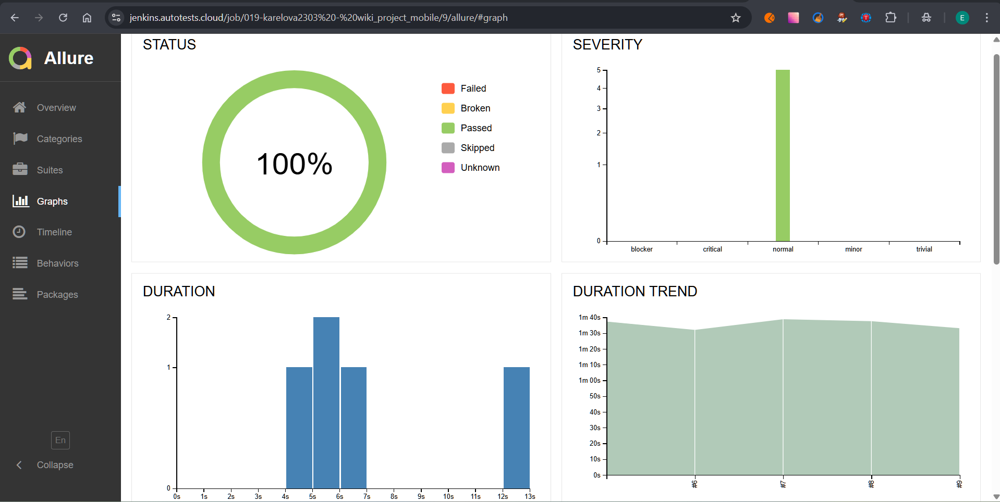

<h1> Проект по тестированию мобильного приложения "Wikipedia"</h1>

<h3> Список проверок, реализованных в автотестах:</h3>

### Mobile-тесты
- [x] Проверка отображения экранов приветствия
- [x] Поиск контента по тексту
- [x] Создание и изменение списка

----
### Проект реализован с использованием:

  &nbsp;
  &nbsp; 
  &nbsp;  
  &nbsp;
  &nbsp;  
  &nbsp;    
  &nbsp;
  &nbsp;
  &nbsp;
  &nbsp;
&nbsp;

----
### Локальный запуск

#### Команды запуска в терминале:
> - для запуска на эмуляторе андроида: `pytest -s -v --context=emulator`
> - для запуска на реальном девайсе: `pytest -s -v --context=local_device`
> - для удаленного запуска на BrowserStack: `pytest -s -v --context=browserstack`

> [!IMPORTANT]
> 
> Параметр `--context` необязателен, по умолчанию тесты запускаются удаленно на BrowserStack

----
### Удаленный запуск автотестов выполняется на сервере Jenkins
> <a target="_blank" href="https://jenkins.autotests.cloud/job/019-karelova2303%20-%20wiki_project_mobile/">_**Ссылка на сборку в Jenkins**_</a>

#### Для запуска автотестов в Jenkins

1. Открыть <a target="_blank" href="https://jenkins.autotests.cloud/job/019-karelova2303%20-%20wiki_project_mobile/">проект</a>
2. Выбрать пункт `Build with Parameters`
3. Нажать кнопку `Build`

----
### Allure отчет

#### Формирование отчета:
>-  локальный запуск: ввести в командной строке `allure serve allure-results`
>-  запуск через Jenkins: кликнуть кнопку `Allure Report` в боковом меню 

#### Результаты запусков

----
### Интеграция с Allure TestOps

> <a target="_blank" href="https://allure.autotests.cloud/project/4798/dashboards">_**Ссылка на проект в Allure TestOps**_</a>

#### Пример dashboard с общими результатами тестирования

#### Общий список всех тест-кейсов

#### Пример отчёта выполнения одного из автотестов

#### Пример dashboard с результатами запуска

#### История запуска тестовых наборов

----
### Интеграция с Jira
> <a target="_blank" href="https://jira.autotests.cloud/browse/HOMEWORK-1465">_**Ссылка на задачу в Jira**_</a>

----
### Оповещение о результатах прогона тестов в Telegram

----

### Пример видео прохождения mobile-автотеста

    

